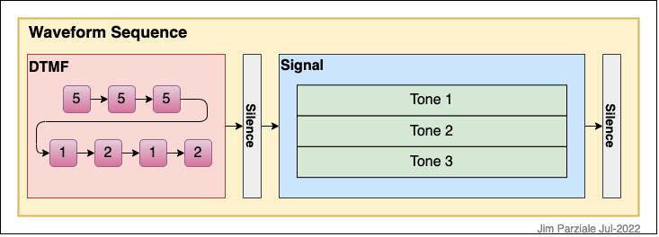
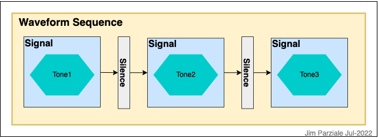

# SigGen

## Overview

Program to create a waveform from a sequence of signals based on an XML signal descriptor file.

## External Dependencies

* [FFTW](http://www.fftw.org/doc/)  
  FFTW is a collection of fast C routines to compute the discrete Fourier transform.
* [TinyXML2](https://github.com/leethomason/tinyxml2)  
  TinyXML-2 is a simple, small, efficient, C++ XML parser that can be easily integrated into other programs.

## Description

I created this project over years of working on software modems (softmodems), and then also needing to generate
alarm/miscellaneous tones for devices (medical, ring tones, etc.)

What I came up with was a way to generate a waveform from a sequence of signals into a single raw file.
The output files can be converted to WAV files for listening. Many of the sample sequences are from old
modem signalling specifications, some are used to create the special telephone tones (like the one you
hear when you dial a wrong number). Others are sample medical device tones based on the IEC 60601-1-8
guidelines.

The program reads in an XML file that describes the entire waveform that will be generated.  
It outputs the waveform data in two formats: float numbers in ASCII text (file.out),
and 32-bit float data in binary (file.dat).

### Architecture
The following is a class diagram showing the software architecture:

  

### Waveform Definition

A waveform in this context is defined as a sequence of signals, silence, DTMF sequence, and/or other sequences
concatenated in the time domain.

A sequence in general has a name and a description. The outermost sequence contains the overall sampling rate
of the components of the waveform. This is used for everything contained within the sequence.

A signal is defined as a list of sinusoids (tones) that are added together in amplitude.
The signal as a name, description, duration (in milliseconds) or number of samples, a rise and fall time,
and a list of tones.
Each tone is described by a frquency, amplitude, phase, a list of harmonics, and a list of those harmonics' amplitudes.

A DTMF sequence is what you think it is: a list of characters you'd find on a telephone. The DTMF sequence
consists of the character string, and on (length of each tone) and off (silence between tones) times in milliseconds.

The following are visual representations of sample waveform sequences:

  

  

