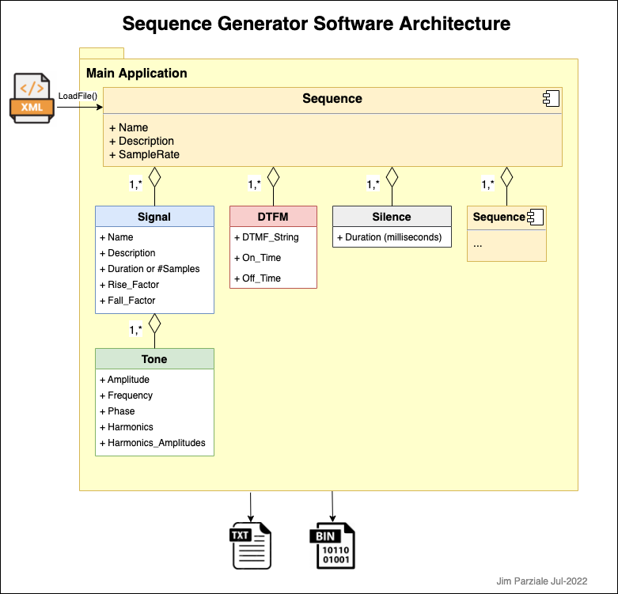

# SigGen

## Overview

Program to create a sequence of signals based on an XML signal descriptor file.

## Files

```text
SigGen
  |-- data
  |   |-- A_desc.xml
  |   |-- B_desc.xml
  |   |-- C4-Maj_desc.xml
  |   |-- IC_desc.xml
  |   |-- IC.xlsx
  |   |-- LP_desc.xml
  |   |-- PerfHi_desc.xml
  |   |-- PerfHi2Even_desc.xml
  |   |-- PerfHi3Odd_desc.xml
  |   |-- PerfLow_desc.xml
  |   |-- PerfMed_desc.xml
  |   |-- Seq1_desc.xml
  |   |-- Seq2_desc.xml
  |   |-- SequenceDesc.dtd
  |   |-- Sig1_desc.xml
  |   |-- SIT_desc.xml
  |   |-- VentHi1Odd_desc.xml
  |   `-- VentHi2Even_desc.xml
  |-- documents
  |   |-- C4-ff-pp.gif
  |   |-- C4-ff-pp.xlsx
  |   |-- pitches.xlsx
  |   |-- SequenceGenerator.drawio
  |   `-- SequenceGenerator.png
  |-- include
  |   |-- DTMF.h
  |   |-- Sequence.h
  |   |-- SigGen.h
  |   `-- Signal.h
  |-- source
  |   |-- DTMF.cpp
  |   |-- Sequence.cpp
  |   |-- SigGen.cpp
  |   `-- Signal.cpp
  `-- test
      `-- test-SeqGen.sh
```

## External Dependencies

* [FFTW](http://www.fftw.org/doc/)  
  FFTW is a collection of fast C routines to compute the discrete Fourier transform.
* [TinyXML2](https://github.com/leethomason/tinyxml2)  
  TinyXML-2 is a simple, small, efficient, C++ XML parser that can be easily integrated into other programs.

## Description

I created this project over years of working on software modems (softmodems), and then also needing to generate
alarm/miscellaneous tones for devices (medical, ring tones, etc.)

What I came up with was a way to generate a sequence of signals into a single raw file. The output files
can be converted to WAV files for listening. Many of the sample sequences are from old modem signalling
specifications, some are used to create the special telephone tones (like the one you hear when you dial
a wrong number). Others are sample medical device tones based on the IEC 60601-1-8 guidelines.


  


  


